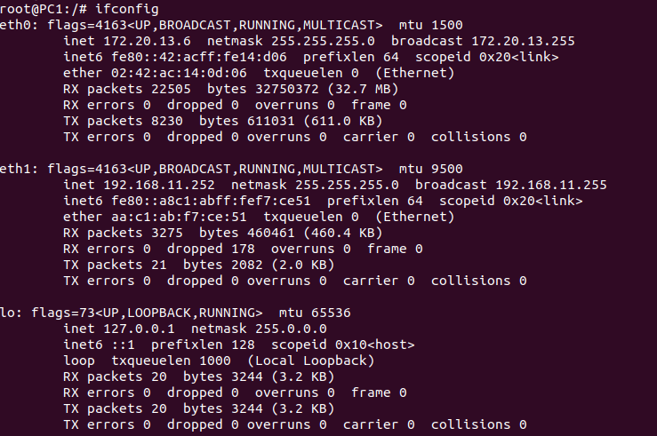

University: [ITMO University](https://itmo.ru/ru/)  
Faculty: [FICT](https://fict.itmo.ru)  
Course: [Introduction in routing](https://github.com/itmo-ict-faculty/introduction-in-routing)  
Year: 2023/2024  
Group: K33202  
Author: Subbota Anton Dmitrievich 
Lab: Lab1  
Date of create: 10.10.2023  
Date of finished: 13.11.2023  

## Цель работы
Ознакомиться с инструментом ContainerLab, основами оборудования Mirkotik, настроить работу VLAN и DCHP.

## Ход работы

1. Создание роутеров и свичей через containerlab. В файле lab1.clab.yml описана топология и соединения.
2. Для удобства настройки был установлен WinBox.
3. На компьютеры установлены сетевые пакеты.
4. Cхема приведена в файле schema.jpg
5. Проверка работоспособности показана в файле check.png
6. В итоге устройства настроены следующим образом:

R01.TEST


```
/interface vlan
add interface=ether1 name=vlan11 vlan-id=11
add interface=ether1 name=vlan22 vlan-id=22
/interface wireless security-profiles
set [ find default=yes ] supplicant-identity=MikroTik
/ip pool
add name=dhcp_pool0 ranges=192.168.11.2-192.168.11.254
add name=dhcp_pool1 ranges=192.168.22.2-192.168.22.254
/ip dhcp-server
add address-pool=dhcp_pool0 disabled=no interface=vlan11 name=dhcp1
add address-pool=dhcp_pool1 disabled=no interface=vlan22 name=dhcp2
/ip address
add address=172.31.255.30/30 interface=ether1 network=172.31.255.28
add address=192.168.11.1/24 interface=vlan11 network=192.168.11.0
add address=192.168.22.1/24 interface=vlan22 network=192.168.22.0
/ip dhcp-client
add disabled=no interface=ether1
/ip dhcp-server network
add address=192.168.11.0/24 gateway=192.168.11.1
add address=192.168.22.0/24 gateway=192.168.22.1
/system identity
set name=R01.TEST
```
SW01.L3.01.TEST


```
/interface bridge
add name=bridge1
add name=bridge11
add name=bridge22
/interface vlan
add interface=ether2 name=vlan11_eth2 vlan-id=11
add interface=ether3 name=vlan11_eth3 vlan-id=11
add interface=ether2 name=vlan22_eth2 vlan-id=22
add interface=ether4 name=vlan22_eth3 vlan-id=22
/interface wireless security-profiles
set [ find default=yes ] supplicant-identity=MikroTik
/interface bridge port
add bridge=bridge11 interface=vlan11_eth2
add bridge=bridge22 interface=vlan22_eth3
add bridge=bridge22 interface=vlan22_eth2
add bridge=bridge11 interface=vlan11_eth3
/ip address
add address=172.31.255.30/30 interface=ether1 network=172.31.255.28
/ip dhcp-client
add disabled=no interface=bridge11
add disabled=no interface=bridge22
add disabled=no interface=ether1
/system identity
set name=SW01.L3.01.TEST
```
SW02.L3.01.TEST


```
/interface bridge
add name=bridge11
/interface vlan
add interface=ether2 name=vlan11 vlan-id=11
/interface wireless security-profiles
set [ find default=yes ] supplicant-identity=MikroTik
/interface bridge port
add bridge=bridge11 interface=ether3
add bridge=bridge11 interface=vlan11
/ip address
add address=172.31.255.30/30 interface=ether1 network=172.31.255.28
/ip dhcp-client
add disabled=no interface=ether1
add disabled=no interface=bridge11
/system identity
set name=SW02.L3.01.TEST
```
SW02.L3.02.TEST


```
/interface bridge
add name=bridge22
/interface vlan
add interface=ether2 name=vlan22 vlan-id=22
/interface wireless security-profiles
set [ find default=yes ] supplicant-identity=MikroTik
/interface bridge port
add bridge=bridge22 interface=vlan22
add bridge=bridge22 interface=ether3
/ip address
add address=172.31.255.30/30 interface=ether1 network=172.31.255.28
/ip dhcp-client
add disabled=no interface=ether1
add disabled=no interface=bridge22
/system identity
set name=SW02.L3.02.TEST

```

PC1


```
root@PC1:/# ifconfig
eth0: flags=4163<UP,BROADCAST,RUNNING,MULTICAST>  mtu 1500
        inet 172.20.13.6  netmask 255.255.255.0  broadcast 172.20.13.255
        inet6 fe80::42:acff:fe14:d06  prefixlen 64  scopeid 0x20<link>
        ether 02:42:ac:14:0d:06  txqueuelen 0  (Ethernet)
        RX packets 22505  bytes 32750372 (32.7 MB)
        RX errors 0  dropped 0  overruns 0  frame 0
        TX packets 8230  bytes 611031 (611.0 KB)
        TX errors 0  dropped 0 overruns 0  carrier 0  collisions 0

eth1: flags=4163<UP,BROADCAST,RUNNING,MULTICAST>  mtu 9500
        inet 192.168.11.252  netmask 255.255.255.0  broadcast 192.168.11.255
        inet6 fe80::a8c1:abff:fef7:ce51  prefixlen 64  scopeid 0x20<link>
        ether aa:c1:ab:f7:ce:51  txqueuelen 0  (Ethernet)
        RX packets 3275  bytes 460461 (460.4 KB)
        RX errors 0  dropped 178  overruns 0  frame 0
        TX packets 21  bytes 2082 (2.0 KB)
        TX errors 0  dropped 0 overruns 0  carrier 0  collisions 0

lo: flags=73<UP,LOOPBACK,RUNNING>  mtu 65536
        inet 127.0.0.1  netmask 255.0.0.0
        inet6 ::1  prefixlen 128  scopeid 0x10<host>
        loop  txqueuelen 1000  (Local Loopback)
        RX packets 20  bytes 3244 (3.2 KB)
        RX errors 0  dropped 0  overruns 0  frame 0
        TX packets 20  bytes 3244 (3.2 KB)
        TX errors 0  dropped 0 overruns 0  carrier 0  collisions 0

```
PC2
```
root@PC2:/# ifconfig
eth0: flags=4163<UP,BROADCAST,RUNNING,MULTICAST>  mtu 1500
        inet 172.20.13.7  netmask 255.255.255.0  broadcast 172.20.13.255
        inet6 fe80::42:acff:fe14:d06  prefixlen 64  scopeid 0x20<link>
        ether 02:42:ac:14:0d:06  txqueuelen 0  (Ethernet)
        RX packets 22505  bytes 32750372 (32.7 MB)
        RX errors 0  dropped 0  overruns 0  frame 0
        TX packets 8230  bytes 611031 (611.0 KB)
        TX errors 0  dropped 0 overruns 0  carrier 0  collisions 0

eth1: flags=4163<UP,BROADCAST,RUNNING,MULTICAST>  mtu 9500
        inet 192.168.22.252  netmask 255.255.255.0  broadcast 192.168.22.255
        inet6 fe80::a8c1:abff:fef7:ce51  prefixlen 64  scopeid 0x20<link>
        ether aa:c1:ab:f7:ce:51  txqueuelen 0  (Ethernet)
        RX packets 3275  bytes 460461 (460.4 KB)
        RX errors 0  dropped 178  overruns 0  frame 0
        TX packets 21  bytes 2082 (2.0 KB)
        TX errors 0  dropped 0 overruns 0  carrier 0  collisions 0

lo: flags=73<UP,LOOPBACK,RUNNING>  mtu 65536
        inet 127.0.0.1  netmask 255.0.0.0
        inet6 ::1  prefixlen 128  scopeid 0x10<host>
        loop  txqueuelen 1000  (Local Loopback)
        RX packets 20  bytes 3244 (3.2 KB)
        RX errors 0  dropped 0  overruns 0  frame 0
        TX packets 20  bytes 3244 (3.2 KB)
        TX errors 0  dropped 0 overruns 0  carrier 0  collisions 0

```
## Схема


## Проверка работоспособности


