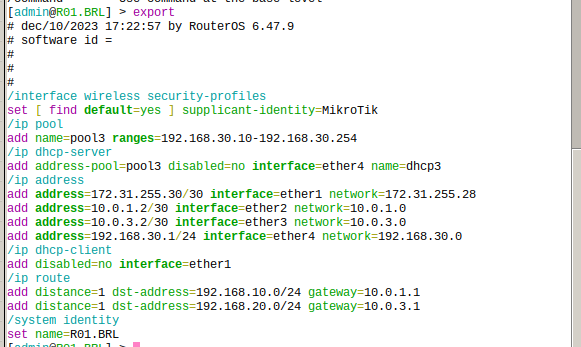

University: [ITMO University](https://itmo.ru/ru/)  
Faculty: [FICT](https://fict.itmo.ru)  
Course: [Introduction in routing](https://github.com/itmo-ict-faculty/introduction-in-routing)  
Year: 2023/2024  
Group: K33202  
Author: Subbota Anton Dmitrievich 
Lab: Lab2  
Date of create: 5.11.2023  
Date of finished: 10.12.2023  

## Цель работы

Ознакомиться с принципами планирования IP адресов, настройке статической маршрутизации и сетевыми функциями устройств.

## Схема

## Ход работы
Устройства настроены следующим образом:

R01.FRT

R01.MSK

R01.BRL

Также настроем маршрутизацию и на компьютерах. Было взято устройства RouterOS, а не linux.

PC1

PC2

PC3

Пинги

## Заключение

Настроена статическая маршрутизация.

