University: [ITMO University](https://itmo.ru/ru/)  
Faculty: [FICT](https://fict.itmo.ru)  
Course: [Introduction in routing](https://github.com/itmo-ict-faculty/introduction-in-routing)  
Year: 2023/2024  
Group: K33202  
Author: Subbota Anton Dmitrievich 
Lab: Lab3
Date of create: 5.11.2023  
Date of finished: 10.12.2023  

## Цель работы

Изучить протоколы BGP, MPLS и правила организации L3VPN и VPLS.

## Схема
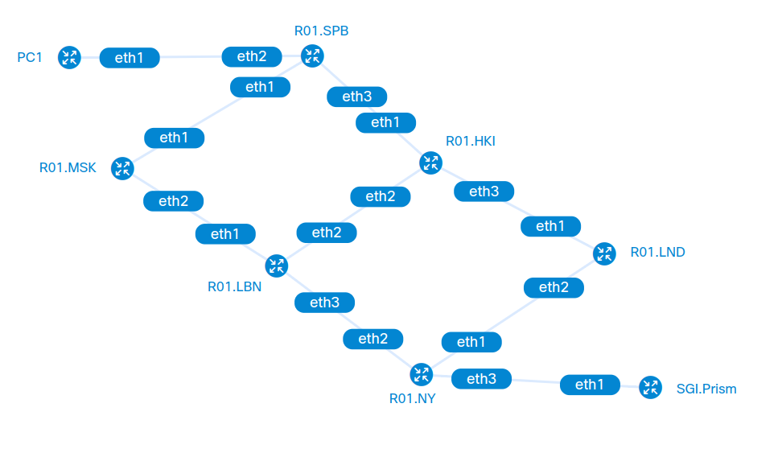

## Ход работы
Устройства настроены следующим образом:

R01.SPB:

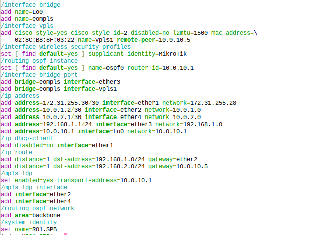

R01.MSK:

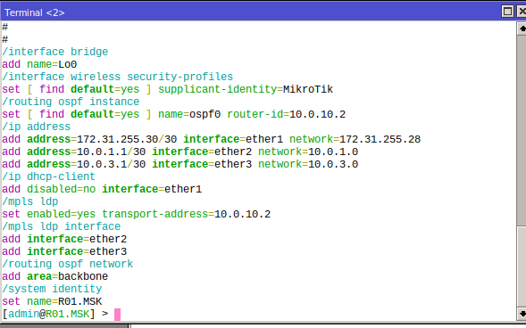

R01.HKI:

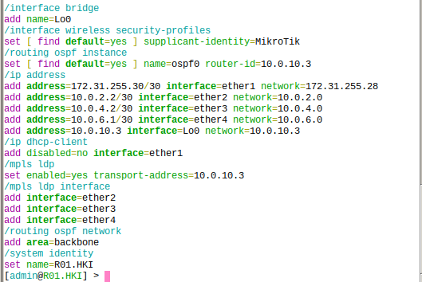

R01.LND:

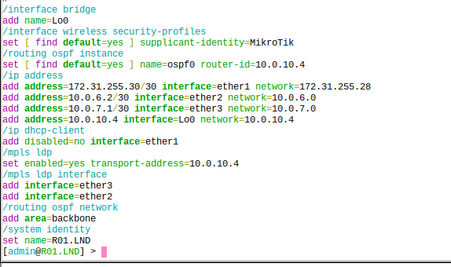

R01.LBN:

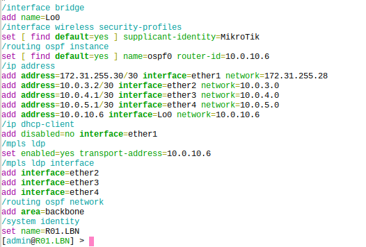

R01.NY:

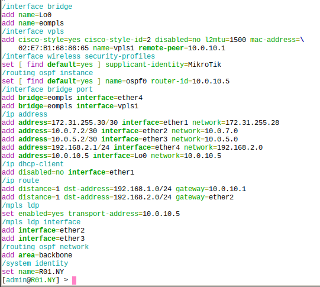

PC1:

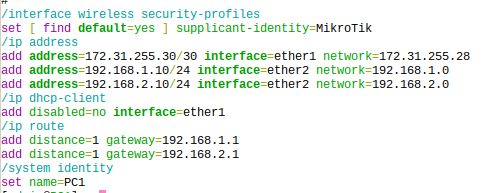

SGI.Prism:

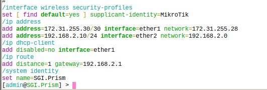

Пинги: 

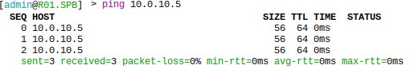
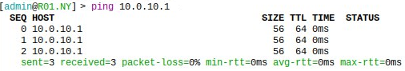

## Заключение

Изучены протоколы BGP, MPLS и правила организации L3VPN и VPLS.

