University: [ITMO University](https://itmo.ru/ru/)  
Faculty: [FICT](https://fict.itmo.ru)  
Course: [Introduction in routing](https://github.com/itmo-ict-faculty/introduction-in-routing)  
Year: 2023/2024  
Group: K33202  
Author: Subbota Anton Dmitrievich 
Lab: Lab4 
Date of create: 1.12.2023  
Date of finished: 17.12.2023  

## Цель работы

Изучить протоколы BGP, MPLS и правила организации L3VPN и VPLS.

## Ход работы

### Схема

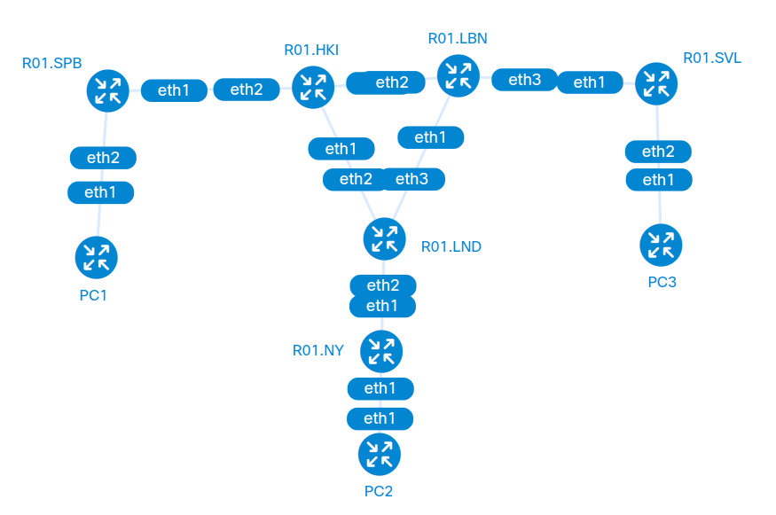

### Первая часть

Конфигурации устройств:

R01.NY:

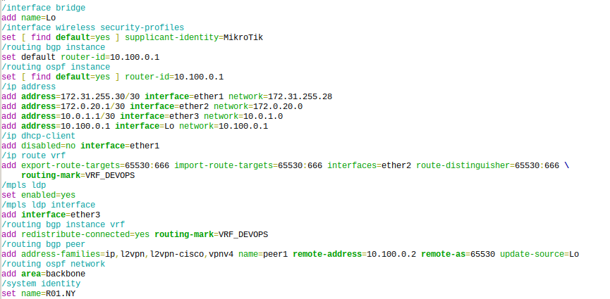

R01.LND:

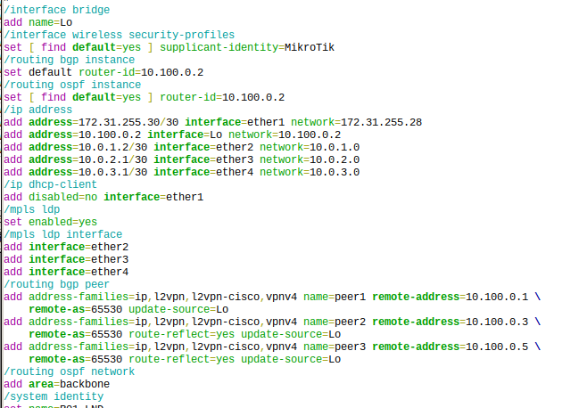

R01.HKI:

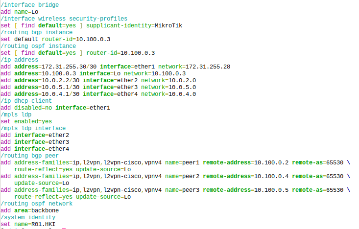

R01.SPB:

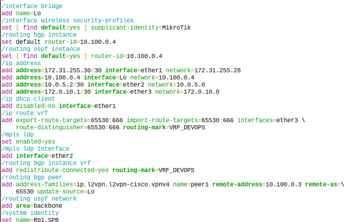

R01.SVL:

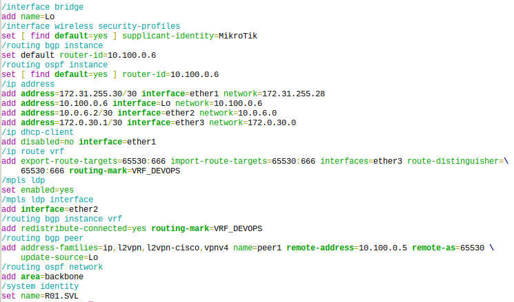

R01.LBN:

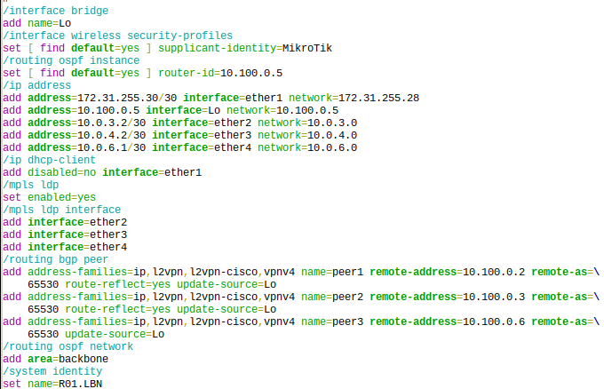

Проверка связи VRF

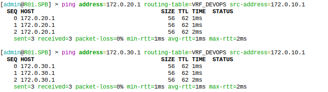

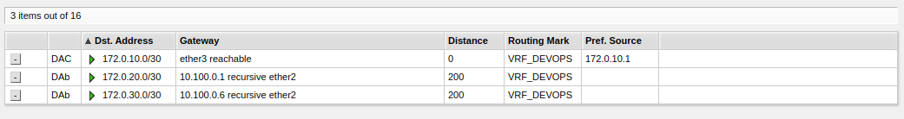

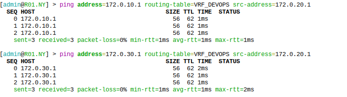

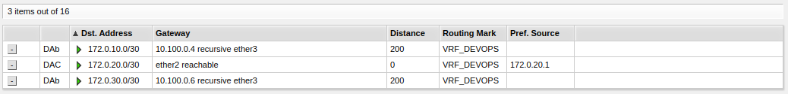

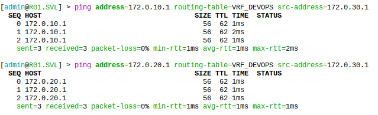

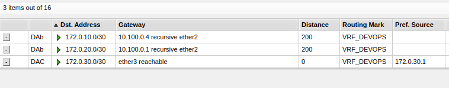

### Вторая часть

Конфигурации устройств:

R01.NY:

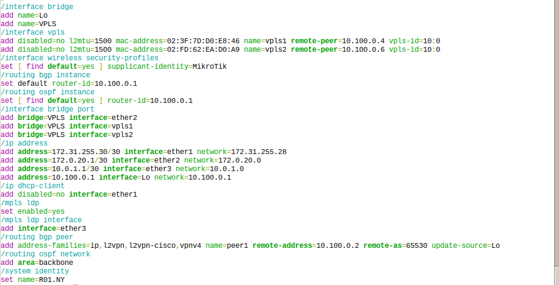

R01.SPB:

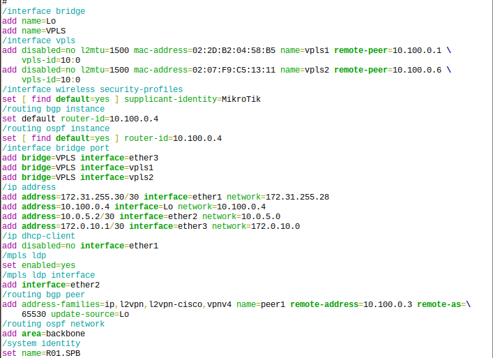

R01.SVL:

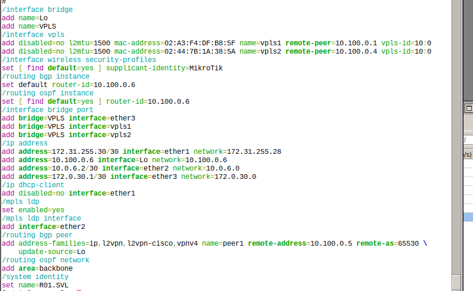

На компьютерах была настроена IP адресация сети 192.168.0.0/24.

Проверка связности VPLS

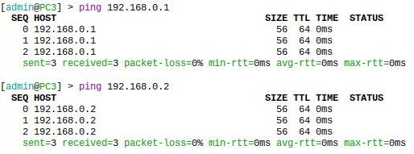

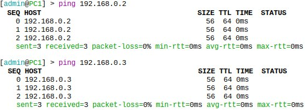

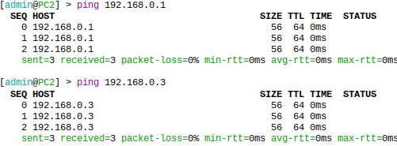

## Заключение

Изучены протоколы BGP, MPLS и правила организации L3VPN и VPLS.
